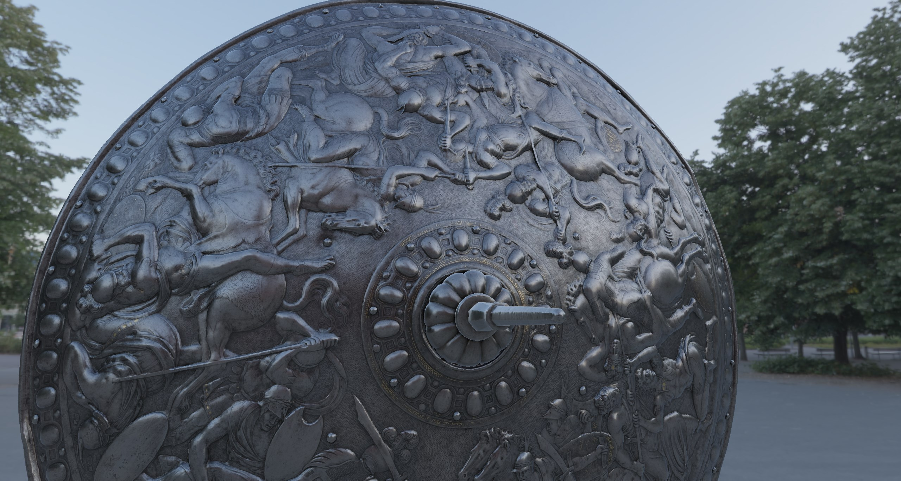
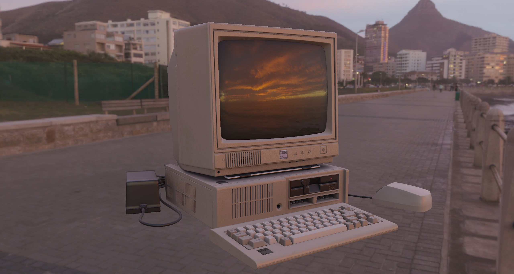
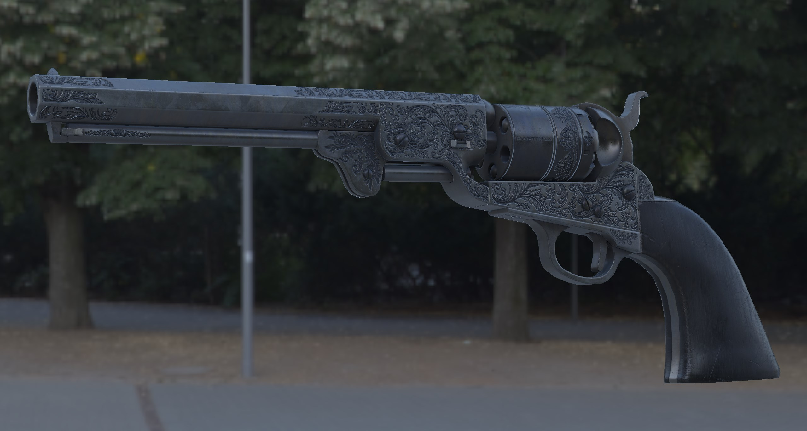
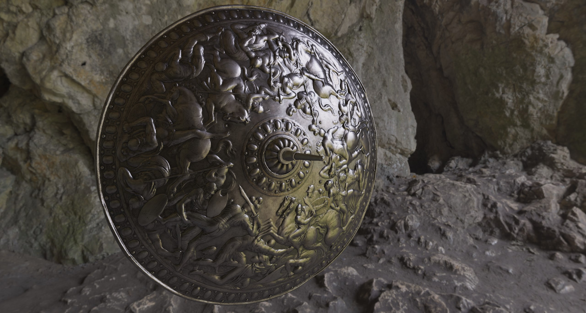
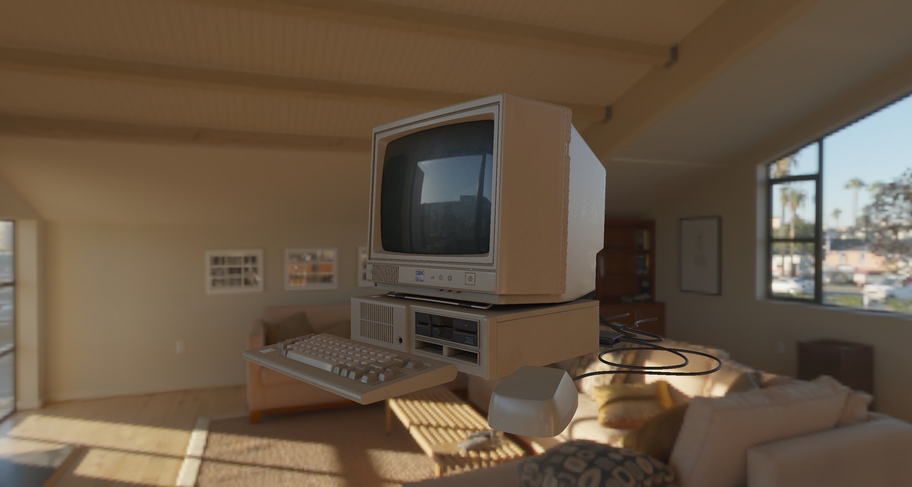
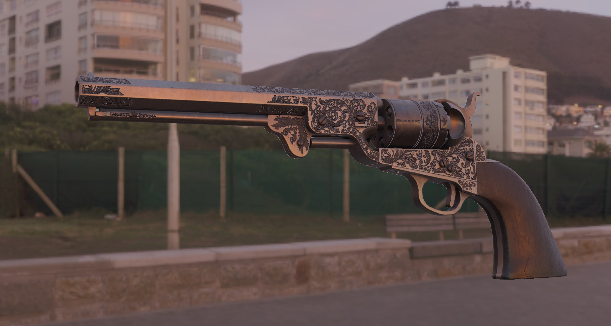
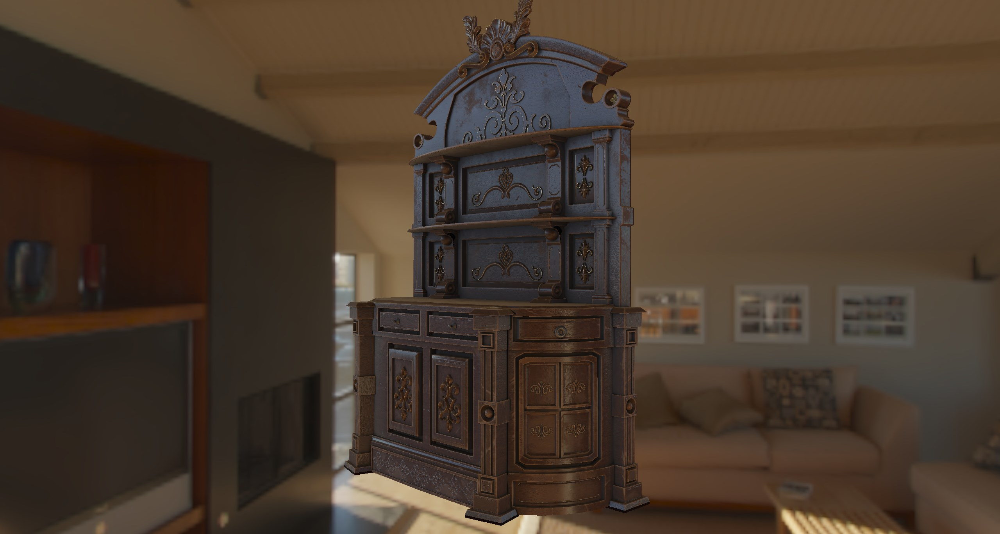
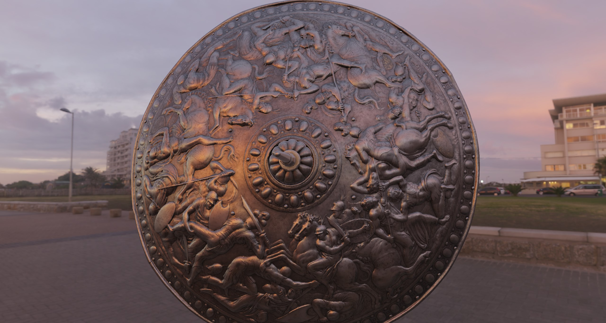

# OpenGL-Playground

This is a personal playground for OpenGL. Fun side project to explore graphics programming. Builds on code developed for CGJ course at IST.

## Notable features

- [x] Scene graph
- [x] Basic camera controls
- [x] Blinn-Phong shading
- [x] Cel shading
- [x] Physically-based rendering
- [x] Image-based lighting
- [x] GLTF model loading (WIP)
- [] Shadow mapping
- [] Ambient occlusion
- [] Much more...

## Controls

- `WASD` to move the camera
- `Space` to move up
- `Left Ctrl` to move down
- Hold `Shift` to move faster
- `Left Click + Mouse` to look around
- `Middle Click + Mouse` to rotate object around Y axis
- `Scroll` to zoom in/out

## Building

Simply open the project in Visual Studio and build.

## Usage

Load your model in the `createEntities()` method of `main.cpp` file. You can also change the lighting and camera settings in the same file.

## Screenshots

